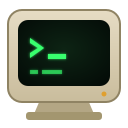

#  veetee

A DEC VT terminal emulator for the Linux (and Windows) desktop, aiming at SmarTerm/Reflection-class
compatibility: VT52 through VT525, DECforms and FMS applications, DEC-faithful fonts,
and SSH, Telnet, serial and LAT connections.

**Website:** [veetee.issinoho.com](http://veetee.issinoho.com/) · **Documentation:** [wiki](https://github.com/issinoho/veetee/wiki)

**Status:** early development — 0.8.6: the VT100 through VT525 (colour, VT500 character sets,
dual sessions, page memory, rectangular operations, soft fonts), an LK401 keyboard map with a
visual editor and VT520 key programming, session recordings, fonts drawn on DEC's own
character cells, VT420 and VT520 Set-Up, sound, smooth scrolling, a CRT picture, saved connections,
session logs, a searchable history and screen reader support, on Linux (including Flatpak) and
Windows. vttest VT100–VT520 menus pass headless,
and esctest2 runs at VT level 5 with every difference from xterm explained against DEC
documentation.

## Layout

| Crate | Purpose |
|-------|---------|
| `crates/vt-parser` | Allocation-free DEC STD 070 / ECMA-48 control function parser (7-bit, 8-bit, UTF-8, VT52) |
| `crates/vt-core` | The terminal model: screen, modes, character sets, reports, DEC keyboard codes |
| `crates/vt-transport` | Host connections: local PTY (ConPTY on Windows), serial lines, Telnet, SSH (via OpenSSH) |
| `crates/vt-fonts` | Original DEC-style bitmap fonts (SIL OFL) for each model's character cells, and their parser |
| `crates/vt-keyboard` | PC keyboard → DEC LK401 key map |
| `crates/vt-render` | OpenGL renderer: dot stretching, scan lines, double-size lines, 132 columns |
| `crates/veetee` | The GTK4/libadwaita application |
| `crates/vt-headless` | CLI driver: `trace` parser actions; `run` scripted sessions with golden screen snapshots |
| `xtask` | `cargo xtask vttest` / `esctest` run the conformance suites against pinned upstream versions; `dist` builds release packages |
| `tests/conformance` | vttest session scripts with golden screens; esctest2 expected failures |
| `docs/compat-matrix.md` | Per-function DEC compatibility status and sources |
| `data/` | Desktop entry, AppStream metadata and application icon |
| `packaging/flatpak` | Flatpak manifest and vendored crate sources |
| `packaging/windows` | Windows zip bundling (MSYS2 GTK runtime) and release signing |
| `fuzz/` | cargo-fuzz targets (nightly) |

## Installing

[Releases](https://github.com/issinoho/veetee/releases) provide a Debian/Ubuntu package and an
x86_64 Linux tarball, both needing GTK 4.14+ and libadwaita 1.5+:

```sh
sudo apt install ./veetee_0.8.6-1_amd64.deb
```

Any Linux distribution with Flatpak can install the Flatpak bundle from a release (it uses the
GNOME runtime from Flathub):

```sh
flatpak install --user ./veetee-0.8.6-x86_64.flatpak
flatpak run com.issinoho.Veetee --telnet vms1
```

In the Flatpak, local shells, commands and `--ssh` run on the host through `flatpak-spawn`, so
they see your own shell, files and `~/.ssh`; settings are kept in
`~/.var/app/com.issinoho.Veetee/config/veetee`. Build it yourself with
`flatpak-builder --user --install --force-clean build packaging/flatpak/com.issinoho.Veetee.yml`.

For Windows 10 (1809) or later, unzip `veetee-0.8.6-x86_64-windows.zip` and run
`bin\veetee.exe`; the GTK runtime is included. Release builds are signed with a Certum code-signing
certificate after publishing (see `packaging/windows/SIGNING.md`). Local command windows use the Windows pseudo
console, `--ssh` uses Windows' OpenSSH client and `--serial COM3` opens a COM port.

Changes are listed in [CHANGELOG.md](CHANGELOG.md).

## Running

Building from source requires GTK 4.14+ and libadwaita 1.5+ development packages
(`sudo apt install libgtk-4-dev libadwaita-1-dev libasound2-dev` on Ubuntu; ALSA is for sound).

```sh
cargo run -p veetee                              # local shell, VT420
cargo run -p veetee -- --telnet vms1             # Telnet (or telnet://vms1:2323)
cargo run -p veetee -- --ssh system@vms1         # SSH via your OpenSSH client and ~/.ssh/config
cargo run -p veetee -- --serial /dev/ttyUSB0     # serial line (see below)
cargo run -p veetee -- --model vt525 --telnet vms1   # colour VT525 (vt100 … vt525)
cargo run -p veetee -- --command 'vttest'        # any program, via /bin/sh -c
cargo run -p veetee -- --record session.vtrec --telnet vms1  # record for replay and tests
cargo run -p veetee -- --sessions 2 --telnet vms1   # two sessions in a split window; F4 switches
```

`cargo run -p veetee -- --help` lists every option. More documentation, including OpenVMS
tips, is in the [wiki](https://github.com/issinoho/veetee/wiki).

Telnet negotiates BINARY (so 8-bit DEC controls pass unchanged), terminal type (`VT420`, or the
selected model), window size and suppress-go-ahead; F5 sends a Telnet BREAK. SSH runs the system
`ssh -tt`, so keys, agents, `ProxyJump` and `known_hosts` behave exactly as in a shell, with
`TERM` set to the emulated model. Network and serial sessions keep their window open when the
connection closes, so the final screen can still be read and copied.

The phosphor colour (white P4, green P1, amber P3; `--phosphor green` at start) and full screen are
in the window menu, with the *Screen* effects: a glow around lit dots and phosphor afterglow (on by
default), a curved screen, and a visible bell that flashes "Bell" on the status line. The CRT
saver blanks an idle screen after the Set-Up time (30 minutes on a VT420). Below
the page is the VT420 indicator status line (reverse video: printer, Hold Screen, keyboard lock,
page number and cursor position); hosts can switch it to a host-writable status line.

### Saved connections

*Connections…* in the window menu lists saved connections: open one in a new window, add, edit
or delete them. *Save as Connection…* saves the current window's connection, model, phosphor and
sessions. They are kept in `~/.config/veetee/profiles.toml`, which can also be edited by hand:

```toml
[[profile]]
name = "vms1"
connection = "telnet"       # shell, command, telnet, ssh or serial
host = "vms1"
model = "vt420"
phosphor = "green"
```

`veetee --profile vms1` opens one from the command line (other options override it, e.g.
`--profile vms1 --model vt520`), and `veetee --list-profiles` lists them.

### History and search

Lines that scroll off the top of the page are kept (10,000 of them). The mouse wheel or
Shift+PgUp/Shift+PgDn moves the screen back through them, as a VT520 reviews previous lines;
typing or new output from the host returns to the page. *Find…* in the window menu (Ctrl+Shift+F)
opens a find bar that searches the history and the page, newest first: Enter finds the next older
match, Shift+Enter the next newer, and Esc closes it.

### Accessibility

The terminal is available to screen readers such as Orca: they can read the lines on the screen
(and Set-Up), follow the cursor, and hear new output and typed text as it appears.

### Session logs

*Log to File…* in the window menu writes the active session's text to a file as it arrives —
with DEC line drawing and national characters as Unicode — until it is chosen again; *Timestamp
Log Lines* starts each line with the date and time. From the command line, `--log FILE` adds to a
file (`~` and `%Y %m %d %H %M %S` are expanded, e.g. `--log ~/logs/vms1-%Y%m%d.log`),
`--log-timestamps` stamps the lines and `--log-raw` keeps the host's bytes exactly as received.
Saved connections can log too (`log = "…"`, `log-timestamps = true`).

### Copy and paste

Drag to select (double-click selects a word, including whole VMS file specifications such as
`DKA0:[SYS0.SYSCOMMON]LOGIN.COM;1`; triple-click selects a line). The selection is copied to the
primary selection, so middle-click pastes it. Ctrl+Shift+C copies to the clipboard and
Ctrl+Shift+V pastes; both are also on the right-click menu.

Text can be selected in the history as well as on the page, and a selection stays with its text
as output scrolls. Copied text is Unicode: DEC line drawing, technical symbols and national
characters come out as the characters they show. Pasted text is sent as if typed through the
host's character sets: line breaks become Return, other control characters are dropped, and
characters the sets lack are replaced by the nearest ones they have (“quotes” and dashes by ASCII,
ł by l, € by EUR), or `?`.

### Serial lines

```sh
cargo run -p veetee -- --serial /dev/ttyUSB0                          # 9600 8N1, XON/XOFF
cargo run -p veetee -- --serial /dev/ttyUSB0 -b 9600 -d 8 -p n -s 1 -f n   # picocom-style options
```

Defaults are the DEC factory Set-Up values: 9600 baud, 8 data bits, no parity, 1 stop bit,
XON/XOFF flow control. `-f h` selects RTS/CTS. F5 sends a line break; F1 (Hold Screen) stops
reading so the line is flow-controlled. The port is opened for exclusive use; add yourself to the
`dialout` group (`sudo usermod -aG dialout $USER`, then log in again) rather than running as root.

### Keyboard

The PC keyboard is mapped to LK401 key positions:

| PC key | DEC key |
|--------|---------|
| F1 F2 F3 F4 F5 | Hold Screen, Print Screen, Set-Up, Session, Break |
| F6–F12, Shift+F1–F10 | F6–F12, F11–F20 (Shift+F5 = Help, Shift+F6 = Do) |
| Ctrl+F5 | Answerback |
| Ctrl+F6–F12, Ctrl+Shift+F1–F10 | User-defined keys (DEC Shift+F6–F20) |
| Insert Home PgUp / Delete End PgDn | Find, Insert Here, Remove / Select, Prev Screen, Next Screen |
| NumLock / * − | PF1 PF2 PF3 PF4 |
| Keypad + (Shift: −) | Keypad , (−) |
| Backspace | `<X]` (sends DEL) |
| Pause, Print Screen, Break (Ctrl+Break) | Hold Screen, Print Screen, Break (Answerback) |
| Ctrl+Shift+C, Ctrl+Shift+V | Copy, Paste |
| Ctrl+↑ ↓, Ctrl+End, Ctrl+PgDn | Pan the view through page memory (lines, pages) |
| Ctrl+Shift+M | Mark a checkpoint in the session recording |
| Shift+PgUp, Shift+PgDn, mouse wheel | Review the session's history (scrollback) |
| Ctrl+Shift+F | Find in the history |

Keys click, BEL rings the warning bell and hosts can play notes (DECPS), as on the terminal;
Keyboard Set-Up (F3) turns the keyclick and bells down or off. A VT420 scrolls smoothly at nine
lines a second, as the hardware did; for fast output choose *Jump Scroll* in Display Set-Up and
Save.

Ctrl and Alt with the editing, cursor and function keys pass on to the DEC key, so a VT520
receives its DECFNK sequences (Ctrl+Insert is Ctrl+Find, `CSI 1;5~`).

The map is a TOML file. *Keyboard Map…* in the window menu opens an LK401 keyboard to rebind
keys; Save writes `~/.config/veetee/keymap.toml`, and `--keymap FILE` uses another map. Print
Screen is not implemented yet.

### Set-Up

F3 (or *Set-Up* in the window menu) opens the terminal's own Set-Up. The VT100 to VT420 models
show a VT420's screens: the Set-Up Directory and the Global, Display, General, Communications,
Printer, Keyboard and Tab screens. The VT510, VT520 and VT525 show the VT500 series' pull-right
menus, with the Set-Up summary line in place of the status line; there the arrow keys move
through the menus and Enter chooses. The host is held while Set-Up is open. The arrow keys move the field cursor and
Enter steps the highlighted feature to its next setting or performs an action; changes take
effect when you leave Set-Up with F3 or Exit. *Save* keeps the settings as the power-up settings
(`~/.config/veetee/setup-vt420-session1.conf`, per model and session), *Recall* returns to them and
*Default* to the factory settings. Global Set-Up's *Local* disconnects the keyboard from the host,
as on the terminal.

### Recording sessions

`--record FILE.vtrec` records a session: what the host sent, the terminal's replies and named
checkpoints (Ctrl+Shift+M). Typed keys are left out unless `--record-keys` is given, so passwords
stay out of the file. `vt-headless replay FILE.vtrec` plays a recording through the emulator
and compares the screen at each checkpoint; the OpenVMS acceptance suite in
`tests/conformance/openvms` works this way.

## Development

```sh
cargo test --workspace
cargo xtask vttest                    # vttest conformance (needs curl, a C compiler, make)
cargo xtask vttest --bless vt102/menu2  # re-record snapshots after reviewing a change
cargo xtask esctest                   # esctest2 against expected-failures.txt (needs git, python3)
cargo xtask openvms                   # replay OpenVMS session recordings
cargo xtask dist                      # release tarball, .deb (needs cargo-deb) and SHA256SUMS
cargo run -p vt-headless -- trace --utf8 some-capture.bin
cargo +nightly fuzz run parser        # requires cargo-fuzz
cargo run --release -p vt-core --example terminal_throughput   # MB/s for typical host output
```

## License

Code is dual-licensed under [MIT](LICENSE-MIT) or [Apache-2.0](LICENSE-APACHE), at your
option. Only permissively-licensed dependencies are accepted (enforced by `cargo deny`).
The bundled fonts are original designs released under the SIL Open Font License
(`crates/vt-fonts/fonts/OFL.txt`).
